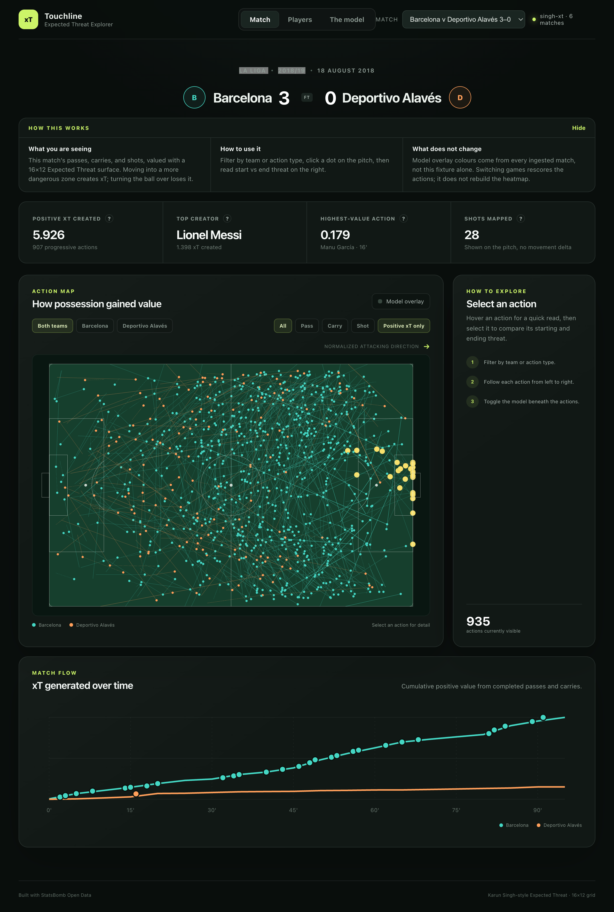
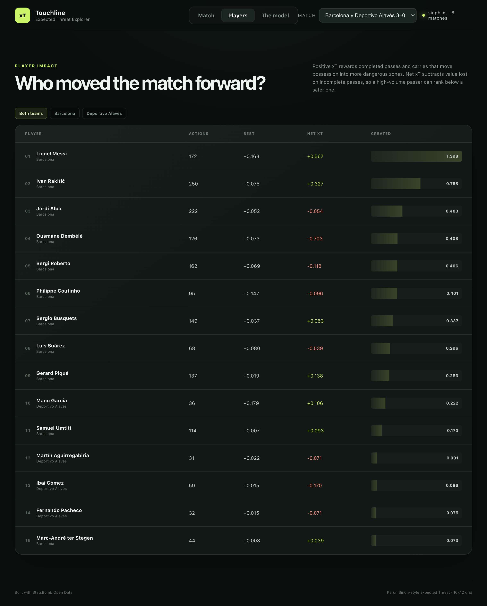
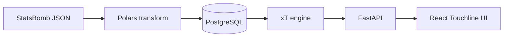

# Touchline — Expected Threat Explorer

Touchline is a full-stack football analytics app that turns [StatsBomb Open Data](https://github.com/statsbomb/open-data) into an interactive Expected Threat (xT) explorer.

It ingests event-level match data into Postgres, fits a [Karun Singh-style](https://karun.in/blog/expected-threat.html) xT surface on a 16×12 pitch grid, and scores every pass, carry, and shot so you can inspect **who moved threat**, not just who shot.



The model is unsmoothed and trained on a small open-data corpus. Values are exploratory, not a production-grade xT product.

## Screenshots

**Players** — ranked on-ball impact. Positive xT is threat created; net xT subtracts value lost on incomplete passes.



## What you can explore

- **Match** — interactive pitch, action filters, and an xT timeline
- **Players** — ranked on-ball impact (positive and net xT)
- **The model** — the global xT surface that actions are scored against

## Architecture



| Layer | Role |
| --- | --- |
| [`001_initial_schema.sql`](001_initial_schema.sql) | Match, player, event, and ingestion-lineage tables |
| [`events_transform.py`](events_transform.py) / [`events_loader.py`](events_loader.py) | Flatten StatsBomb events and COPY them into Postgres |
| [`xt_engine.py`](xt_engine.py) | Solve `(I - P) xT = b` from shots, moves, and zone transitions |
| [`main.py`](main.py) | REST API for matches, the xT surface, and scored analytics |
| [`frontend/src`](frontend/src) | Vite + React + TypeScript explorer |

## Quick start

You need **Python 3.11+**, **Node.js 20+**, and a local **PostgreSQL** instance.

```bash
# 1. Database
createdb footballanalysis
psql footballanalysis -f 001_initial_schema.sql

# 2. API
python3 -m venv .venv
source .venv/bin/activate
pip install -r requirements.txt
python run_pipeline.py data/15946.json
uvicorn main:app --reload --port 8000

# 3. UI (separate terminal)
cd frontend
npm install
npm run dev
```

Open [http://localhost:5173](http://localhost:5173). The Vite dev server proxies `/api` to `http://127.0.0.1:8000`.

Default database URL is `postgresql://postgres@localhost:5432/footballanalysis`. Override with `DATABASE_URL` if your local role or port differs.

To load a competition-season instead of one file:

```bash
python ingest_open_data.py --competition 43 --season 3 --limit 8
```

Event, lineup, and match-catalogue JSON live in [`data/`](data/).

## Tests

```bash
python -m unittest tests.test_match_analytics
```

## Data credit

Event, lineup, and match data are from **StatsBomb Open Data**. StatsBomb are the original source of the data; this project does not claim ownership of it. See [statsbomb/open-data](https://github.com/statsbomb/open-data) for licence terms.

The xT formulation follows Karun Singh’s public Expected Threat write-up.

## Scope

- Singh-style xT on a 16×12 StatsBomb grid, without spatial smoothing
- On-ball actions only: passes, carries, and shots
- Showcase matches include a 2018/19 La Liga fixture (`15946`) and 2018 World Cup matches
