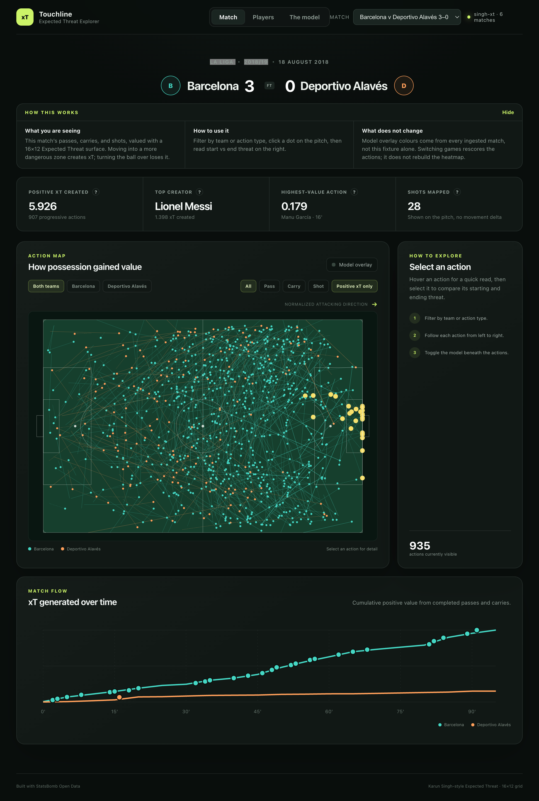
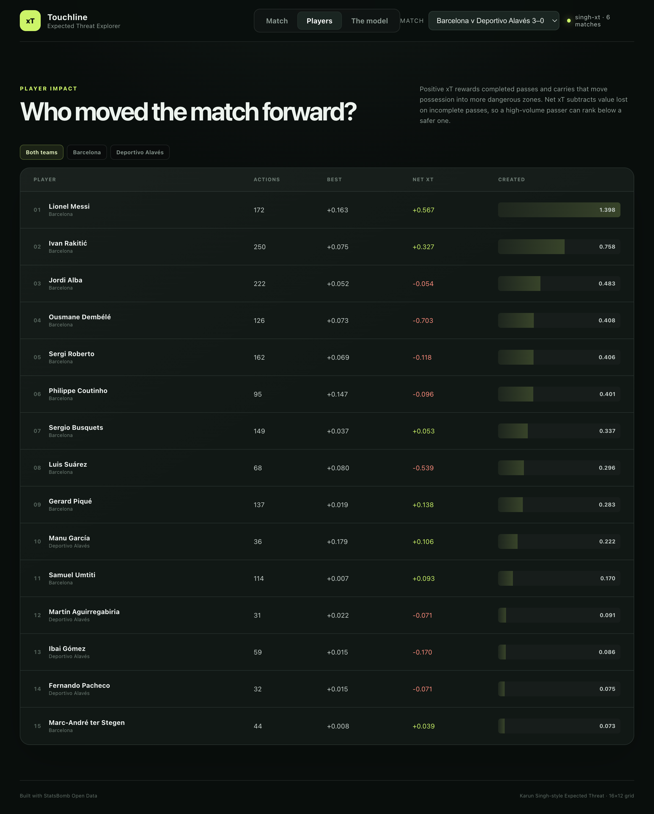
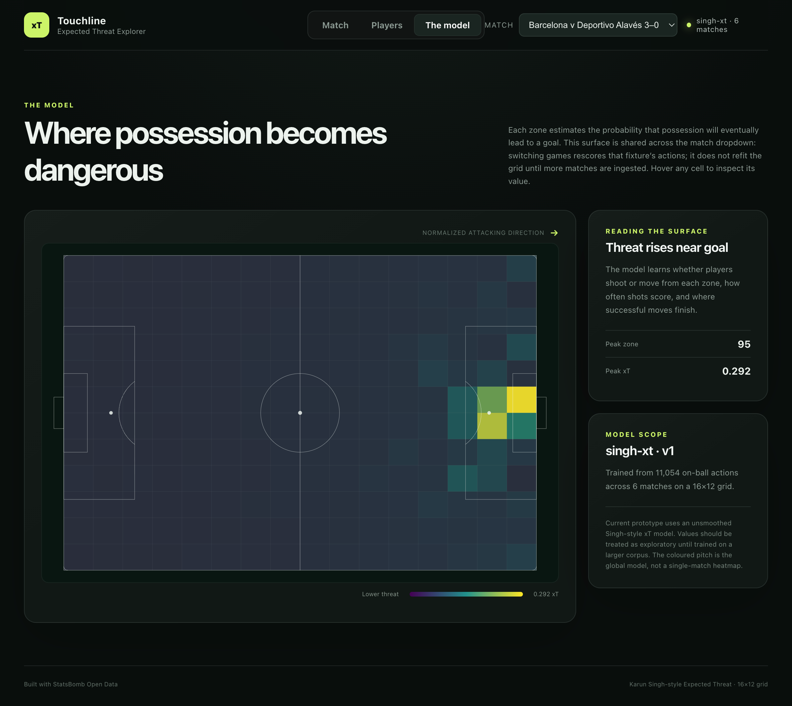
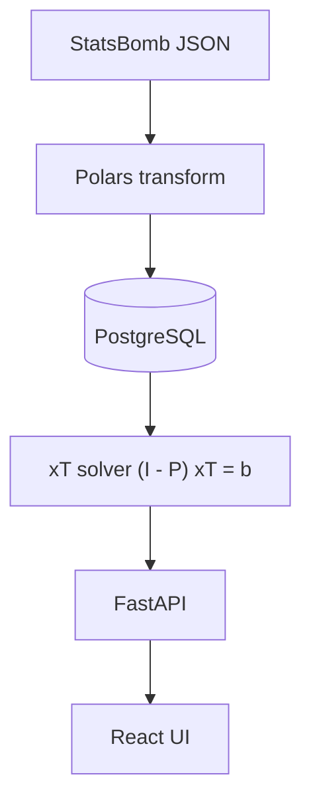

# Touchline — Expected Threat Explorer

[](https://github.com/Salama-Khan/expectedthreatmodel/actions/workflows/tests.yml)

Touchline is a full-stack football analytics app that turns [StatsBomb Open Data](https://github.com/statsbomb/open-data) into an interactive Expected Threat (xT) explorer.

It ingests event-level match data into Postgres, fits a [Karun Singh-style](https://karun.in/blog/expected-threat.html) xT surface on a 16×12 pitch grid, and scores every pass, carry, and shot so you can inspect **who moved threat**, not just who shot.



## Screenshots

**Players** — ranked on-ball impact. Positive xT is threat created; net xT subtracts value lost on incomplete passes.



**The model** — the global 16×12 xT surface. Threat rises toward goal; this grid is shared across matches, not a single-game heatmap.



## What you can explore

- **Match** — interactive pitch, action filters, and an xT timeline
- **Players** — ranked on-ball impact (positive and net xT)
- **The model** — the global xT surface that actions are scored against

## Architecture


```mermaid
flowchart TD
  StatsBomb[StatsBomb JSON] --> Transform[Polars transform]
  Transform --> Postgres[(PostgreSQL)]
  Postgres --> XtEngine["xT solver (I - P) xT = b"]
  XtEngine --> API[FastAPI]
  API --> UI[React UI]
```

| Layer | Role |
| --- | --- |
| [`001_initial_schema.sql`](001_initial_schema.sql) | Match, player, event, and ingestion-lineage tables |
| [`events_transform.py`](events_transform.py) / [`events_loader.py`](events_loader.py) | Flatten StatsBomb events and COPY them into Postgres |
| [`xt_engine.py`](xt_engine.py) | Solve `(I - P) xT = b` from shots, moves, and zone transitions |
| [`main.py`](main.py) | REST API for matches, the xT surface, and scored analytics |
| [`pass_complete.py`](pass_complete.py) | Logistic regression on pass start/end zone; split by match |
| [`frontend/src`](frontend/src) | Vite + React + TypeScript explorer |

## Pass-complete check (not xT)

[`pass_complete.py`](pass_complete.py) is a leakage check, not a second threat model.

- **Label:** same rule as scoring. `outcome IS NULL` → complete. Any outcome → failed (leak to zero).
- **Features:** start zone and end zone on the 16×12 grid.
- **Split:** `GroupShuffleSplit` on `match_id`. Held-out matches: `7538`, `7539`, `8650` (2,743 passes).
- **Base rate:** 2,197 complete / 546 incomplete. A dummy that always predicts complete is already ~80% accurate. The model is 82.5%.
- **Failed-pass recall:** 0.181 (99 of 546). Precision on that call is 0.756 — when it says failed, it is usually right; it almost never says failed.
- **Complete recall:** 0.985. Macro-average recall is 0.583.

Start/end zone does not see pressure, height, or receiver, so most failures look like ordinary zone-to-zone passes. That is why Touchline scores a failed pass with the leak-to-zero rule, not this classifier.


## Quick start (Docker, recommended)

You need **Docker Desktop**, running. Check with `docker info`; if it prints an error, start Docker Desktop first. Docker needs several GB of free disk space for the Postgres and Python images.

```bash
# 1. Start Postgres, the API and the UI (applies 001_initial_schema.sql on first start)
docker compose up --build -d

# 2. Load one match into the container database
docker compose run --rm -v "$(pwd)/data:/app/data" api python run_pipeline.py data/15946.json
```

Check it worked: open [http://127.0.0.1:8000/api/matches/15946/analytics](http://127.0.0.1:8000/api/matches/15946/analytics). The interactive API docs are at [http://127.0.0.1:8000/docs](http://127.0.0.1:8000/docs).

To check the load from the database side:

```bash
docker compose exec db psql -U football_user -d football_db -c "SELECT count(*) FROM events;"
```

Open the UI at [http://localhost:5173](http://localhost:5173). Inside Compose, the Vite dev server proxies `/api` to the `api` service (set by `API_URL`). If the page loads before the API is ready, refresh once.

Open [http://localhost:5173](http://localhost:5173). The Vite dev server proxies `/api` to `http://127.0.0.1:8000`.

**Notes**

- The database is also reachable from your machine on port **5433** (not 5432, to avoid clashing with a local Postgres): `psql -h localhost -p 5433 -U football_user football_db`.
- The credentials in `docker-compose.yml` are **local-development defaults**, not for deployment.
- `docker compose down` stops everything and keeps your data. `docker compose down -v` also deletes the database volume. The schema file only runs when the volume is empty, so after changing the schema you need `down -v` and a fresh load.

## Quick start (without Docker)

You need **Python 3.11+** (CI tests 3.11, 3.12 and 3.13), **Node.js 20+**, and a local **PostgreSQL** with a `postgres` role.

Check your versions first: `python3 --version`. If your default `python3` is older than 3.11, use an explicit interpreter such as `python3.12` below.

```bash
# 1. Database (these commands use the postgres role)
createdb -U postgres footballanalysis
psql -U postgres -d footballanalysis -f 001_initial_schema.sql

# 2. API
python3.12 -m venv .venv
source .venv/bin/activate        # repeat this in every new terminal
pip install -r requirements.txt
python run_pipeline.py data/15946.json
python -m uvicorn main:app --reload --port 8000
```

Confirm the virtual environment is active (your prompt starts with `(.venv)`, and `which python` points inside `.venv`). Use `python -m uvicorn` so the venv's Python is the one that runs.

Check the load: `psql -U postgres -d footballanalysis -c "SELECT count(*) FROM events;"`, then open [http://127.0.0.1:8000/api/matches/15946/analytics](http://127.0.0.1:8000/api/matches/15946/analytics).

Then start the UI as in the Docker section.

Default database URL is `postgresql://postgres@localhost:5432/footballanalysis`. Override it with the `DATABASE_URL` environment variable (both the API and `run_pipeline.py` read it).

To load a competition-season instead of one file:

```bash
python ingest_open_data.py --competition 43 --season 3 --limit 8
```

Event, lineup, and match-catalogue JSON live in [`data/`](data/).
## Tests

```bash
python -m unittest discover -s tests
```

Run it inside the activated virtual environment. GitHub Actions runs the same tests on Python 3.11, 3.12 and 3.13 for every push to `main` and every pull request ([`.github/workflows/tests.yml`](.github/workflows/tests.yml)).

## Data credit

Event, lineup, and match data are from **StatsBomb Open Data**. StatsBomb are the original source of the data; this project does not claim ownership of it. See [statsbomb/open-data](https://github.com/statsbomb/open-data) for licence terms.

The xT formulation follows Karun Singh’s public Expected Threat write-up.

## Scope

- Singh-style xT on a 16×12 StatsBomb grid, without spatial smoothing
- Trained on a small open-data corpus; values are exploratory, not a production-grade xT product
- On-ball actions only: passes, carries, and shots
- Showcase matches include a 2018/19 La Liga fixture (`15946`) and 2018 World Cup matches
